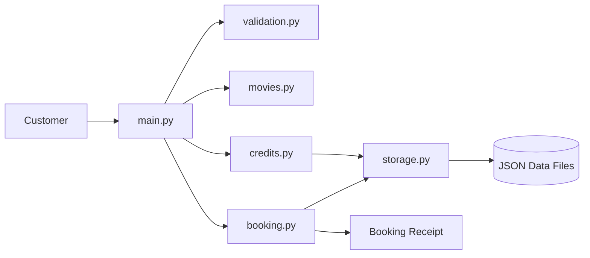
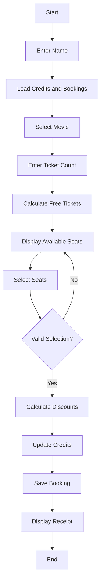
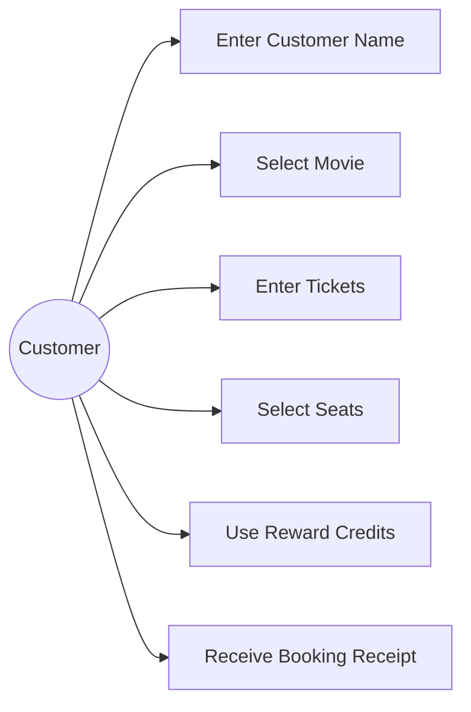
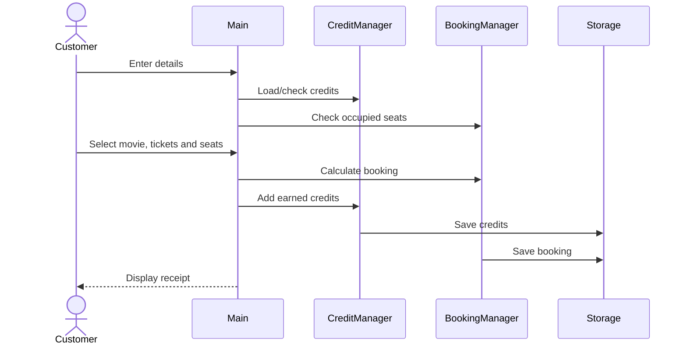
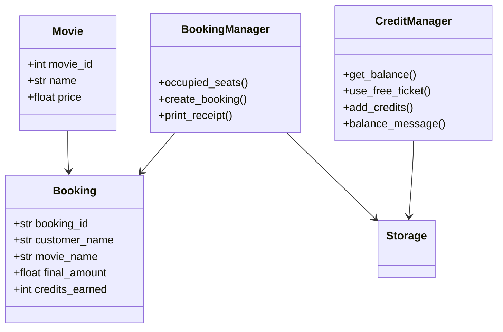
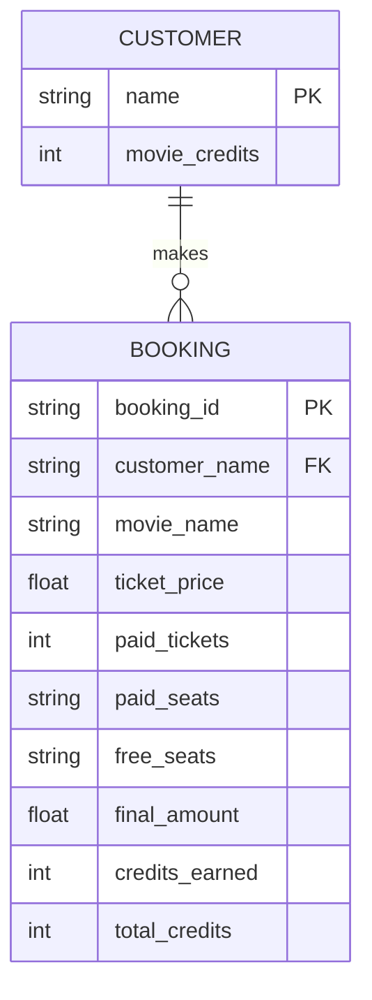

# System Architecture

```mermaid
flowchart LR
    U[Customer] --> M[main.py]
    M --> V[validation.py]
    M --> MV[movies.py]
    M --> C[credits.py]
    M --> B[booking.py]
    C --> S[storage.py]
    B --> S
    S --> D[(JSON Data Files)]
    B --> R[Booking Receipt]
```

# Workflow

```mermaid
flowchart TD
    A[Start] --> B[Enter Name]
    B --> C[Load Credits and Bookings]
    C --> D[Select Movie]
    D --> E[Enter Ticket Count]
    E --> F[Calculate Free Tickets]
    F --> G[Display Available Seats]
    G --> H[Select Seats]
    H --> I{Valid Selection?}
    I -- No --> G
    I -- Yes --> J[Calculate Discounts]
    J --> K[Update Credits]
    K --> L[Save Booking]
    L --> M[Display Receipt]
    M --> N[End]
```

# Use Case Diagram

```mermaid
flowchart LR
    Customer((Customer))
    Customer --> UC1[Enter Customer Name]
    Customer --> UC2[Select Movie]
    Customer --> UC3[Enter Tickets]
    Customer --> UC4[Select Seats]
    Customer --> UC5[Use Reward Credits]
    Customer --> UC6[Receive Booking Receipt]
```

# Sequence Diagram

```mermaid
sequenceDiagram
    actor Customer
    participant Main
    participant Credit as CreditManager
    participant Booking as BookingManager
    participant Storage

    Customer->>Main: Enter details
    Main->>Credit: Load/check credits
    Main->>Booking: Check occupied seats
    Customer->>Main: Select movie, tickets and seats
    Main->>Booking: Calculate booking
    Main->>Credit: Add earned credits
    Credit->>Storage: Save credits
    Booking->>Storage: Save booking
    Main-->>Customer: Display receipt
```

# Class / Component Diagram

```mermaid
classDiagram
    class Movie {
        +int movie_id
        +str name
        +float price
    }
    class Booking {
        +str booking_id
        +str customer_name
        +str movie_name
        +float final_amount
        +int credits_earned
    }
    class CreditManager {
        +get_balance()
        +use_free_ticket()
        +add_credits()
        +balance_message()
    }
    class BookingManager {
        +occupied_seats()
        +create_booking()
        +print_receipt()
    }
    CreditManager --> Storage
    BookingManager --> Storage
    BookingManager --> Booking
    Movie --> Booking
```

# ER / Storage Design

```mermaid
erDiagram
    CUSTOMER ||--o{ BOOKING : makes
    CUSTOMER {
        string name PK
        int movie_credits
    }
    BOOKING {
        string booking_id PK
        string customer_name FK
        string movie_name
        float ticket_price
        int paid_tickets
        string paid_seats
        string free_seats
        float final_amount
        int credits_earned
        int total_credits
    }
```
